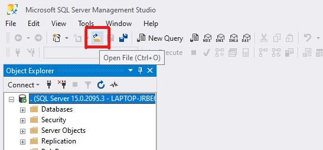
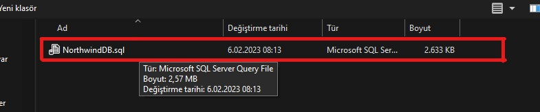
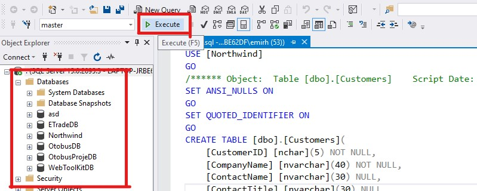

# northwind_backend
ASP.NET Core 6.0 Web API Project
 

Project implements ADO.NET Core 6.0 WebAPI northwind database
This is the project I made while learning WebAPI
 

Technologies required for the project
<pre style="font-size: x-large;">

</pre>
 

SQL Server database script in this directory
<pre style="font-size: x-large;">
SqlServer -> NorthwindDB.sql
</pre>

Follow the given steps to run this project in your localhost
<pre style="font-size: x-large;">
Step 1 : Download the project
Step 2 : Open the MSSQLServer
</pre>

<pre>
Step 3 : Open NorthwindDB.sql
</pre>

<pre>
Step 4 : Running the script.
If you have a database named NorthwindDB, it will be deleted.
</pre>

